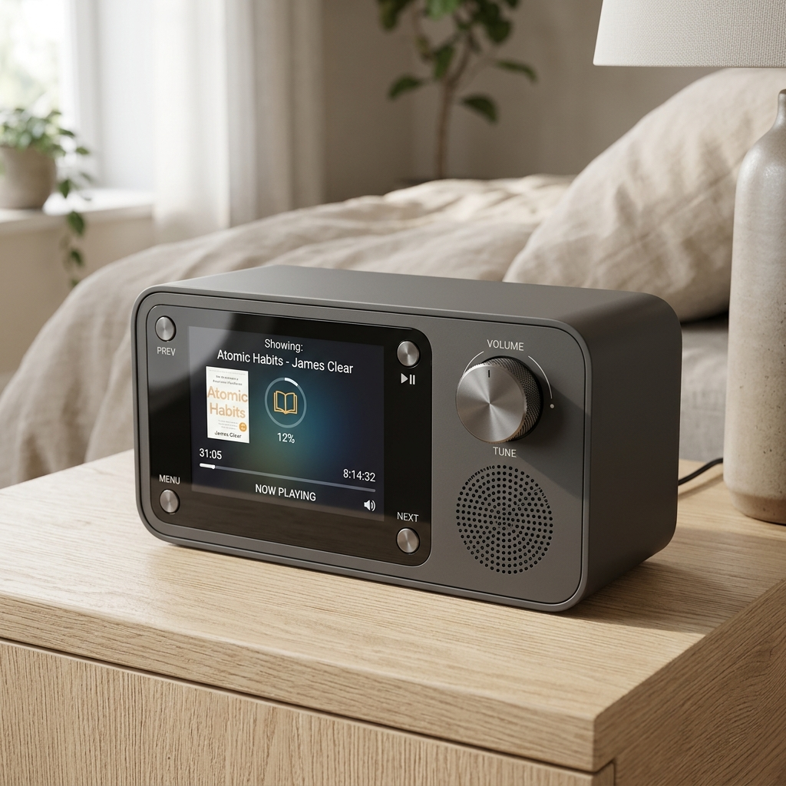
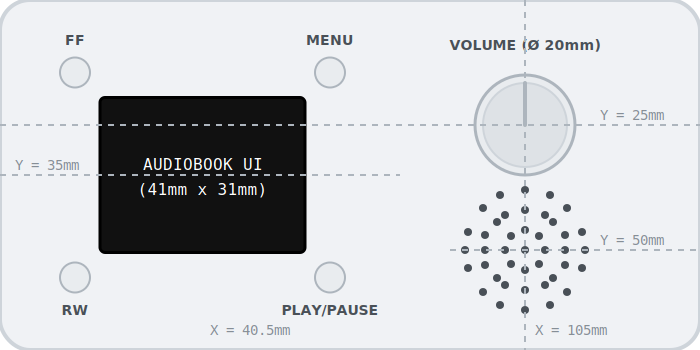
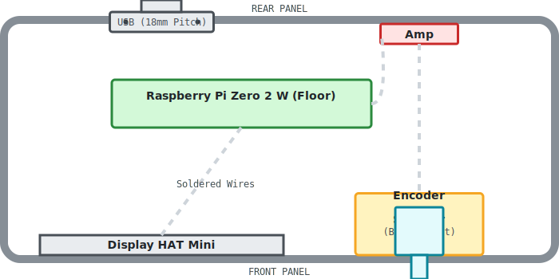
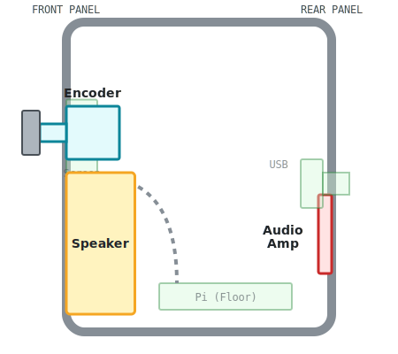

# Bedside Audiobook Appliance Enclosure Design Specification

This document outlines the basic physical structure, layout constraints, and visual direction for the Bedside Audiobook Appliance chassis.

## 1. Component Constraints & Tolerances
To properly model the enclosure, we must account for the following component footprints:
*   **Display HAT Mini (Screen & Buttons)**:
    *   *Footprint*: ~65.5mm (W) x 35mm (H) x ~7mm (D).
    *   *Mounting*: Mounted flush against the inside of the front bezel using custom standoffs or retaining clips. Connected to the Pi via soldered wire harness.
*   **Raspberry Pi Zero 2 W (Compute)**:
    *   *Footprint*: 65mm (W) x 30mm (H) x ~5mm (D).
    *   *Mounting*: 4x M2.5 standoffs mounted directly to the enclosure floor.
*   **Audio Amp (MAX98357A)**: 
    *   *Footprint*: ~19.4mm x 17.8mm x 3.0mm.
    *   *Mounting*: Can be mounted on interior standoffs or slid into a printed rail/slot away from the main stack.
*   **Speaker (Dayton CE32A-4)**: 
    *   *Footprint*: 32mm x 32mm square frame, 15.5mm depth.
    *   *Mounting*: Front-firing through a grille on the right side of the faceplate.
*   **Controls**: 
    *   *Tactile Buttons (x4)*: Embedded directly on the Display HAT at the four corners of the screen. We will use 3D-printed flexible "plungers" built into the front faceplate to actuate them from the outside.
    *   *Rotary Encoder (EC11)*: ~12mm x 12mm body with a threaded neck and D-shaft. Needs a dedicated 7mm mounting hole on the right side of the front panel.
*   **Power Jack (Panel-Mount Micro-USB)**:
    *   *Mounting*: Fastens directly to the rear panel. Screw hole pitch is exactly 18mm (0.7 inch).

## 2. Structural Decisions
*   **Orientation**: Wide, horizontal desktop aspect ratio.
*   **Top/Side Surfaces**: Completely flat and clean (no snooze button, no side cables).
*   **Faceplate Left**: 2.0" landscape display showing audiobook playback UI. Four plunger buttons located precisely at the NW, NE, SW, and SE corners of the screen.
*   **Faceplate Right**: Prominent rotary encoder knob and dotted speaker grille.
*   **Power Access**: Micro-USB port cutout directly on the rear panel. 
*   **Assembly**: A two-piece shell. A front bezel/chassis that holds the components, and a rear "bucket" or hood that snaps or screws into place.

## 3. Button Mapping (Audiobook Reader)
The four corner buttons around the screen will map to the following audiobook controls:
*   **NW (Top-Left)**: Fast Forward (FF)
*   **SW (Bottom-Left)**: Rewind (RW)
*   **NE (Top-Right)**: Menu
*   **SE (Bottom-Right)**: Play/Pause

## 4. Final Design Mockup

This mockup reflects the front-firing speaker choice, the completely clean top and sides, corner screen buttons, and an audiobook interface on the display. The power cable exits entirely from the rear.

## 5. Front Panel Layout

Please see [front_panel_layout.svg](./front_panel_layout.svg) for the exact CAD dimension layout mapping screen, button, and knob centerlines.

## 6. Internal Layout (X-Ray Footprints)

To aid in arranging the internal standoffs and rails, refer to these internal cross-sections showing the 3D stacking of the components within the chassis:

*   **Top-Down Slice (X/Z Plane)**: Shows horizontal layout and depth clearance.  
    
*   **Side-Profile Slice (Y/Z Plane)**: Shows vertical stacking of encoder/speaker.  
    

## 7. 3D Modeling Guide

To start modeling this chassis in Fusion 360 using parameters, see the [Fusion 360 Enclosure Design Guide](../fusion360/fusion_360_enclosure_guide.md).

